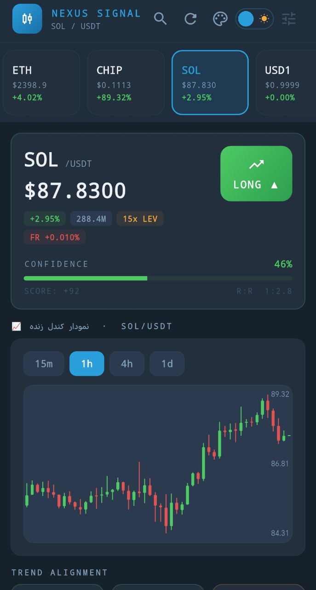
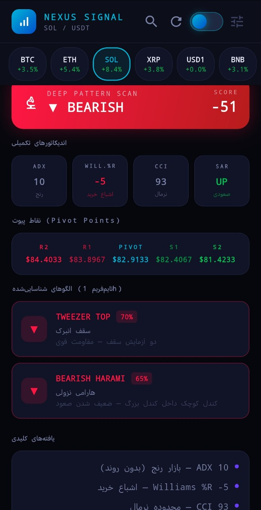
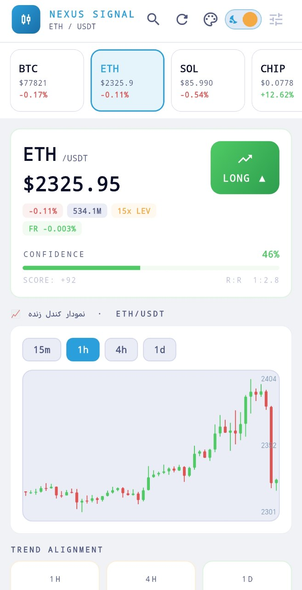
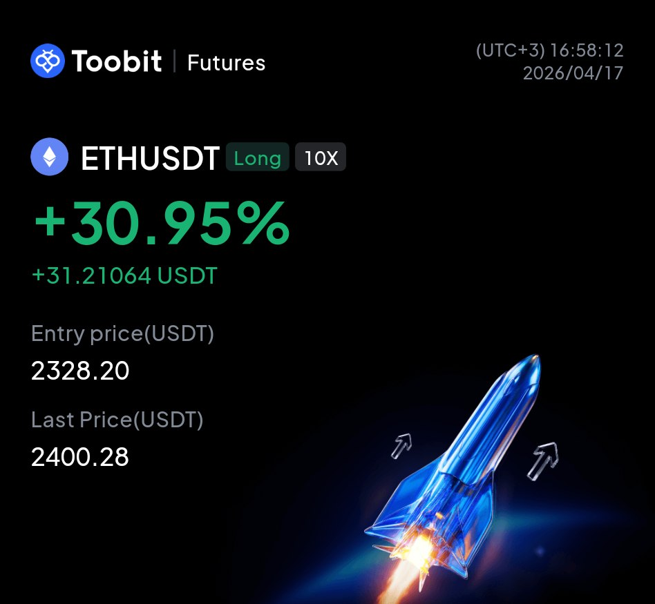
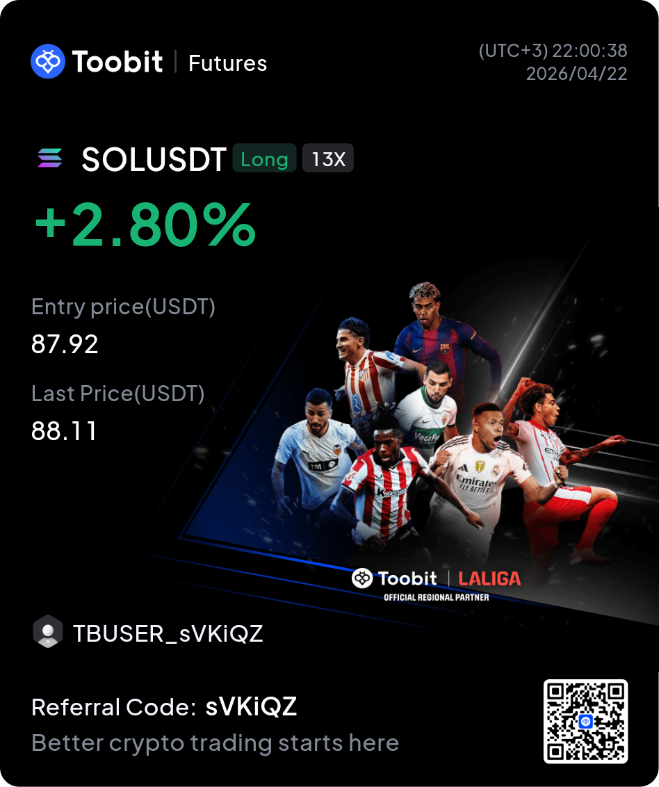

<h1>Hi there, I'm Hossein 👋</h1>
<h3>Mobile App Developer | Flutter Specialist | Clean Architecture Enthusiast</h3>

  

  

---

### 🚀 About Me
- 📱 I specialize in building **high-performance, cross-platform mobile applications** using **Flutter** and **Dart**.
- 🏛️ Passionate about software design, actively applying **Clean Architecture** and **SOLID principles**.
- ⚙️ Automating workflows using **n8n** + AI tools to speed up development.
- 🤖 Building projects with help of **AI prompting** and modern development assistants.

---

### 🛠️ Tech Stack & Tools

  

---

### 🌐 Let's Connect

  
  
  

---

### 📈 Crypto Trading Assistant (Private Project)

A mobile application for analyzing cryptocurrency markets and generating trading signals.

The app scans market charts in real time using custom analysis algorithms that detect trends, support and resistance zones, and common candlestick patterns.

In addition to traditional technical analysis, the project experiments with **AI and machine learning models** to analyze historical market behavior and identify potential trading opportunities. It also considers **large transaction activity (often associated with whales)** and market liquidity patterns to better understand market momentum.

The goal of the app is to help traders monitor the market more efficiently through **real‑time charts, signal alerts, and a clean mobile interface** that makes it easier to review potential trades.

> Note: This is a **private project**, so the source code is not publicly available.

---

### 📱 App Interface

---

### 💰 Sample Signal Results

